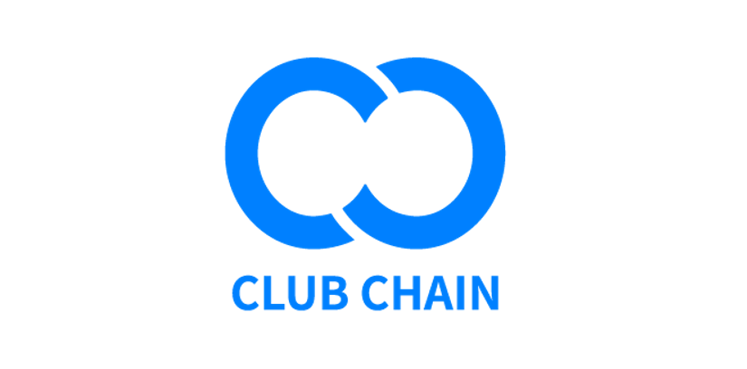
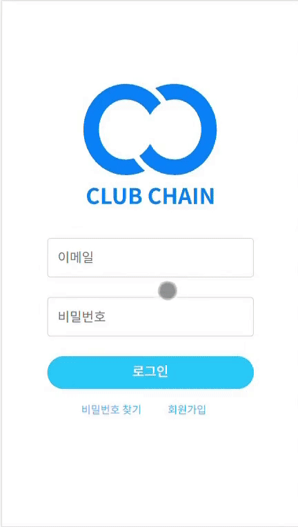
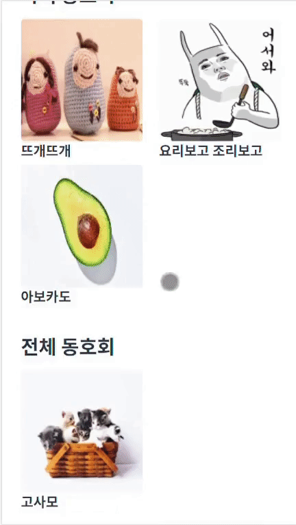
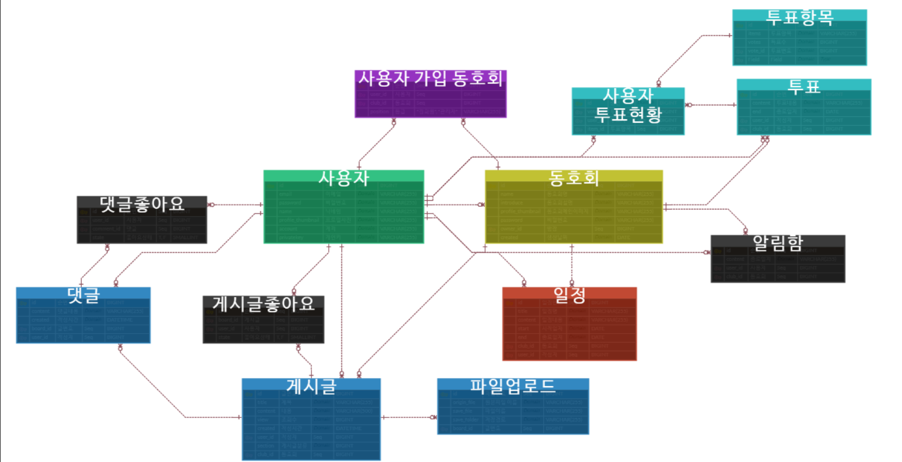
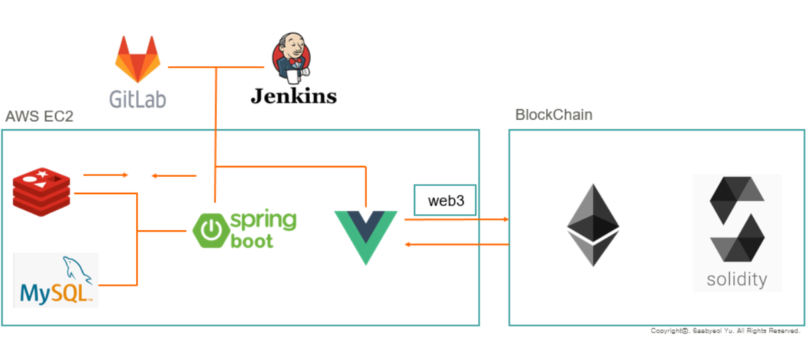

# :moneybag: CLUB CHAIN

> CLUB CHAIN은 블록체인 기반 회비 관리를 바탕으로한 동호회 커뮤니티 서비스입니다.

- 진행 기간 : 21.08.23 ~ 21.10.08

- 목표 
  - 원하는 동호회에 가입하고 투명한 회비 관리로 건강한 동호회 운영을 할 수 있습니다.
  - 다양한 사람들과 취미를 공유할 수 있는 동호회 커뮤니티입니다.

# ⚙ 개발 환경

### Frontend

- Vue.js
- Bootstrap
- VScode

### Backend

- Spring Boot
- JPA
- MySQL
- Redis
- InteliJ 

### Blockchain

- Ethereum
- Web3
- Ropsten
- Solidity

# 📺 주요 기능

>### 1. 로그인 및 동호회 목록
>
>

> ### 2. 동호회 검색
>
> 

> ### 3. 동호회 가입
>
> 

> ### 4. 동호회 메인
>
> 

> ### 4. 회비 관리
>
> 

# :memo: 참고

### 와이어 프레임

- https://www.figma.com/file/YDzkE0zm0g7Ci3NnBMpvTs/%ED%8A%B9%ED%99%94?node-id=1%3A22

### API

- https://vast-utahraptor-e44.notion.site/API-api-39657dc9dfd34f96ada425c1cb638d6e

### ERD

### 아키텍쳐

