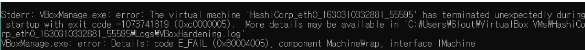
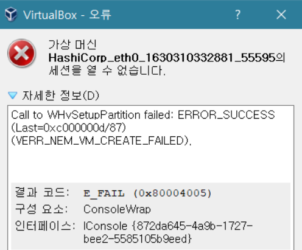
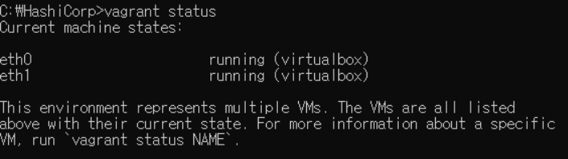
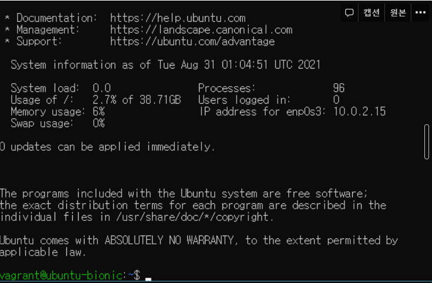
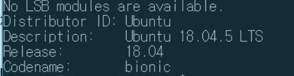
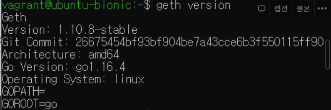
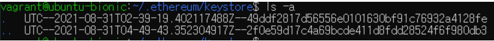
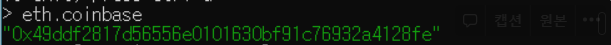
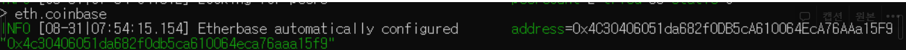

# 1. VirtualBox 설치

- [공식 홈페이지](https://www.virtualbox.org/wiki/Download_Old_Builds_6_0)에서 6.0.0버전으로 다운받기

- 설치 완료!

  

# 2. Vagrant설치

- [공식 홈페이지](https://www.vagrantup.com/)에서 2.2.5버전 설치하기

- 설치 완료 후 버전 확인

  

- 호스트와 가상 머신 간 파일 전송 플러그인 설치

  

- 가상 머신 생성 및 구동

  - 설정 파일 생성

    

- [설정 파일 수정](https://www.44bits.io/ko/post/vagrant-tutorial) : 루비 언어로 작성되어있다.

  ```ruby
  # -*- mode: ruby -*-
  # vi: set ft=ruby :
  
  # All Vagrant configuration is done below. The "2" in Vagrant.configure
  # configures the configuration version (we support older styles for
  # backwards compatibility). Please don't change it unless you know what
  # you're doing.
  
  VAGRANT_API_VERSION="2"
  
  vms = {
    'eth0' => '10',
    'eth1' => '11'
  }
  
  Vagrant.configure(VAGRANT_API_VERSION) do |config| # 베이그런트 설정 형식 버전 2를 사용한다.
    config.vm.box = "ubuntu/bionic64" # 베이그런트가 지원하는 박스들이 있고 그중에 우분투 사용한다.
    vms.each do |key, value|
      config.vm.define "#{key}" do |node|
        node.vm.network "private_network", ip: "192.168.50.#{value}" # 호스트에서만 접근 가능한 아이피 값 지정
        if "#{key}" == "eth0"
          node.vm.network "forwarded_port", guest: 8545, host: 8545 # 가상 머신의 8545 포트를 호스트의 8545 포트에 연결한다.
        end
        node.vm.hostname = "#{key}"
        node.vm.provider "virtualbox" do |nodev| # CPU 프로세스와 메모리 설정(?)
          nodev.memory = 2048
        end
      end
    end
  end # do..end 구조이다.
  ```

- 가상 머신 구동 실패 : 가상 머신 오류

  

  

🖍 **해결 과정**

- 도커가 설치되있어서 나는 오류였다.(하나의 PC에 가상화 툴 하나만 쓸 수 있음)

- **cmd 관리자모드로 열기 → bcdedit /set hypervisorlaunchtype off → 재부팅**

- 실행 결과 eth0과 eth1이 running 상태지만 vagrant up할 때 여전히 같은 오류가 난다.

  

- eth0과 eth1을 virtualbox에서 하나씩 실해시켜줘서 running 상태로 나온것같다.

- 최신 버전이 아니라서 나는 오류라는 이야기도 있는데 더 찾아봐야 할 것 같다.

  

- 가상 머신 접속 : `vagrant ssh eth0`

  

- 가상 머신 환경 알기 : `lsb_release -a`

  

- 종료 : `exit`
- 가상 머신 중지 : `vagrant halt`
- 가상 머신 삭제 : `vagrant destroy`


# 3. 기능 명세

- 참고

  - RPC : 원격 프로시저 호출, 별도의 원격 제어를 위한 코딩 없이 다른 주소 공간에서 함수나 프로시저를 실행할 수 있게하는 프로세스 간 통신 기술,분산 컴퓨팅 환경에서 프로세스 간 상호 통신 및 컴퓨팅 자원의 효율적인 사용을 위해서 발전된 기술이다.

    

## 3-1. 프라이빗 이더리움 네트워크 구축

- 가상 머신에 Geth 설치

  1. `sudo apt-get update` :

  2. `sudo apt-get install software-properties-common` :

  3. `sudo add-apt-repository -y ppa:ethereum/ethereum` :

  4. `sudo apt-get install ethereum` :

  5. `geth version` : geth 버전 확인

     

- RPC API 호출 활성화

  


## 3-2. 이더리움 계정 생성

- Geth 구동 : `geth --dev console`

- 계정 생성 : `personal.newAccount(이름)`

  - 키스토어 파일 확인

    

  🔍 궁금증

  - geth —dev console 로 실행하고 계정 생성을 하면 tmp/go-ethereum-keystore에 저장되고
  - geth console로 실행하고 계정 생성을 하면 /home/vagrant/.ethereum/keystore 에 저장된다
  - 둘의 차이가 뭔데 왜??

- 코인베이스 설정 : 자동으로 첫번째 생성한 계정이 베이스가 된다.

  **eth0**

  

  **eth1**

  ​	