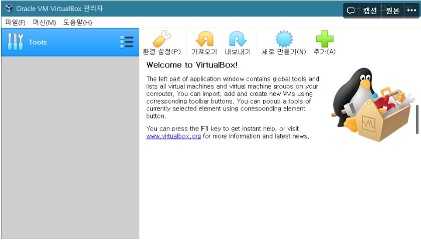
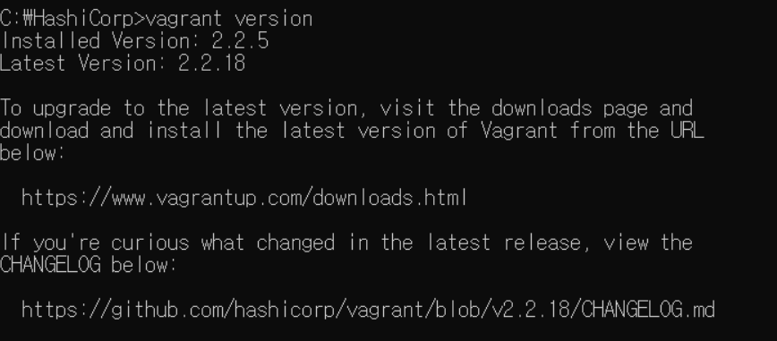
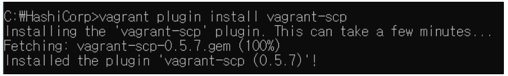
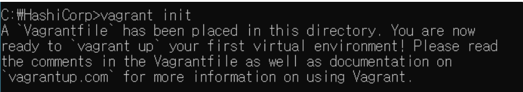

# 1. VirtualBox 설치

- [공식 홈페이지](https://www.virtualbox.org/wiki/Download_Old_Builds_6_0)에서 6.0.0버전으로 다운받기

- 설치 완료!

  

# 2. Vagrant설치

- [공식 홈페이지](https://www.vagrantup.com/)에서 2.2.5버전 설치하기

- 설치 완료 후 버전 확인

  

- 호스트와 가상 머신 간 파일 전송 플러그인 설치

  

- 가상 머신 생성 및 구동

  - 설정 파일 생성

    